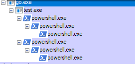

# Golang + spawned processes on Windows + taskkill /t

`taskkill /t` [documentation](https://docs.microsoft.com/en-us/windows-server/administration/windows-commands/taskkill) states that `/t` will kill
the process specified by PID as well as any child processes started by it.
I wanted to see if it also kills child processes started by the child processes.

The reason the language is `Golang` is because I was investigating this [issue](https://github.com/buildkite/agent/issues/794)

## Demo

We create a process tree as follows:

```
main -> child1 -> grandchild1 -> grandchild2
  |
 \ /

child2 -> grandchild3 -> grandchild3
```


Let's see what happens when we send `taskkill /t` to the main process.

Run program:

```
> go run .\test.go
2018/09/21 10:32:28 My PID: 41928
2018/09/21 10:32:28 Child Process ID: 48928
2018/09/21 10:32:28 Child Process ID: 42492

```

At this stage our process tree looks like this:




On a separate window, we send `taskkill /t` to the main PID above:

```
> taskkill /f /t /pid 41928
SUCCESS: The process with PID 47448 (child process of PID 36652) has been terminated.
SUCCESS: The process with PID 48000 (child process of PID 30116) has been terminated.
SUCCESS: The process with PID 36652 (child process of PID 48928) has been terminated.
SUCCESS: The process with PID 30116 (child process of PID 42492) has been terminated.
SUCCESS: The process with PID 48928 (child process of PID 41928) has been terminated.
SUCCESS: The process with PID 42492 (child process of PID 41928) has been terminated.
SUCCESS: The process with PID 41928 (child process of PID 48200) has been terminated.
```


On the first window we will see:
```
2018/09/21 10:32:28 Waiting for commands to finish...
exit status 1
```

So, `taskkill /t` does terminate the grandchildren as well.

## Useful links

- [Identifying child processes in powershell](http://www.boldevin.com/?p=89)
- [Process explorer](https://docs.microsoft.com/en-us/sysinternals/downloads/process-explorer)
